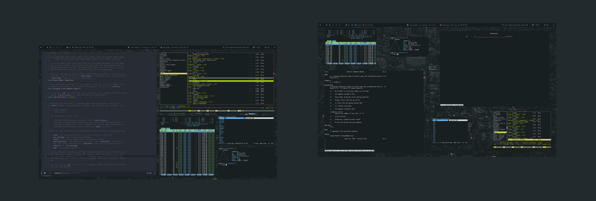
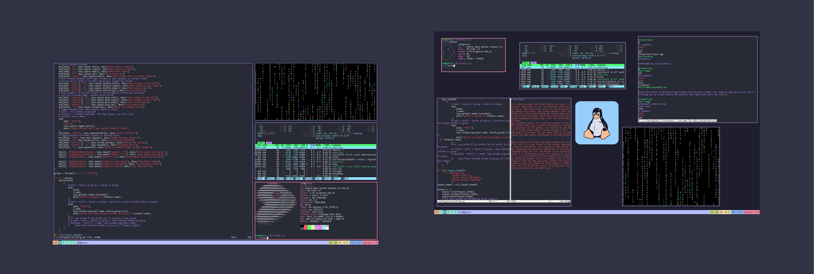
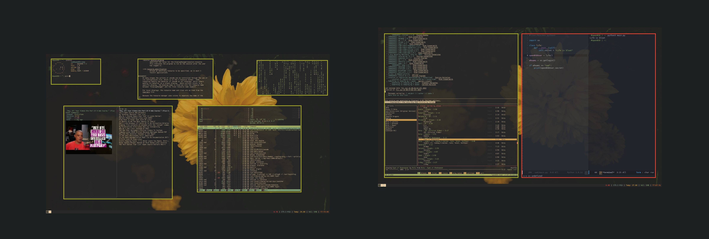

## My dotfiles

### ColorSchemes

- QTile		- Catppuccin
- XMonad	- Gruvbox (Also available as Dracula) [Currently broken on Arch-Bases systems]
- BSPWM		- Everblush
- Xresources 	- Everblush
- i3		- Gruvbox (Dark-ish)

#### NOTE: Control config files ownership. Make sure your user own the files

### Some photos

#### BSPWM:

#### QTile:

#### i3:

